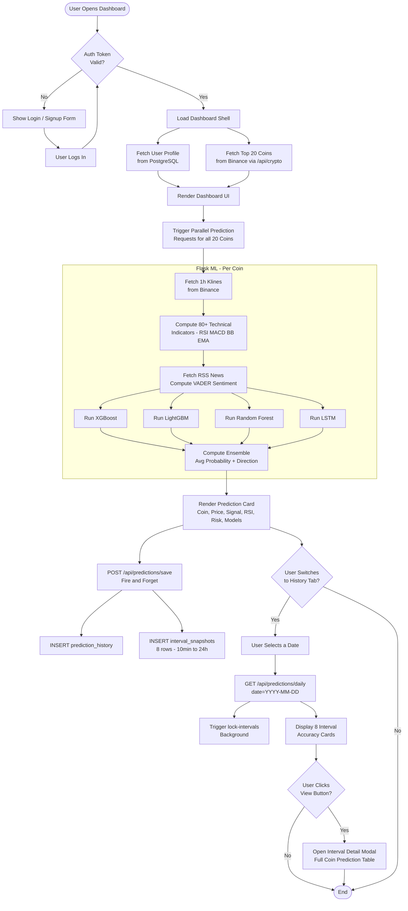
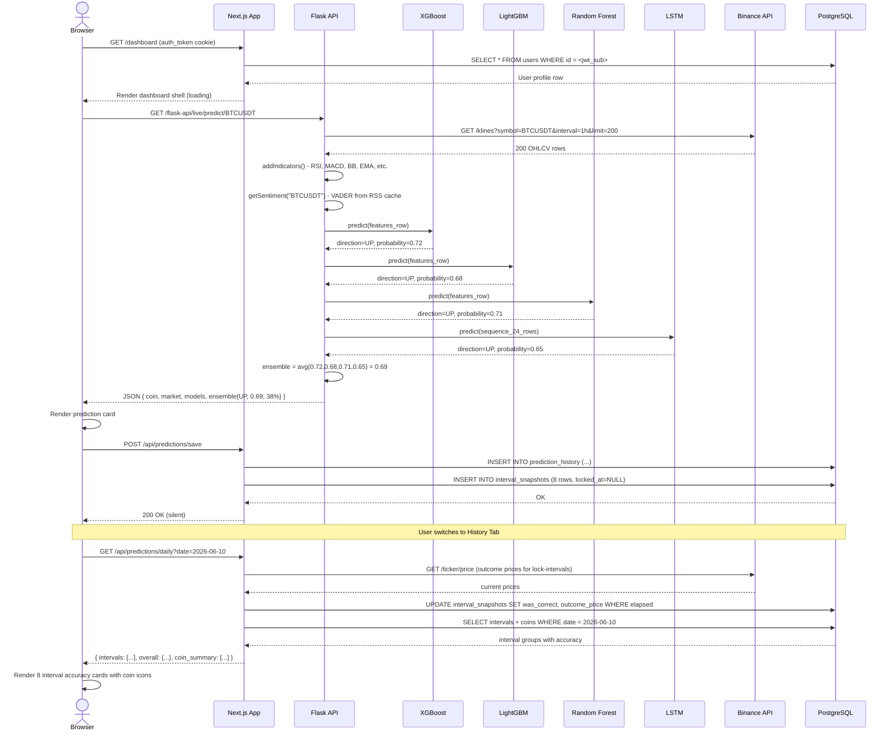
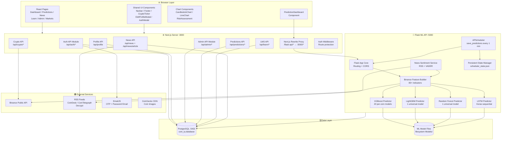
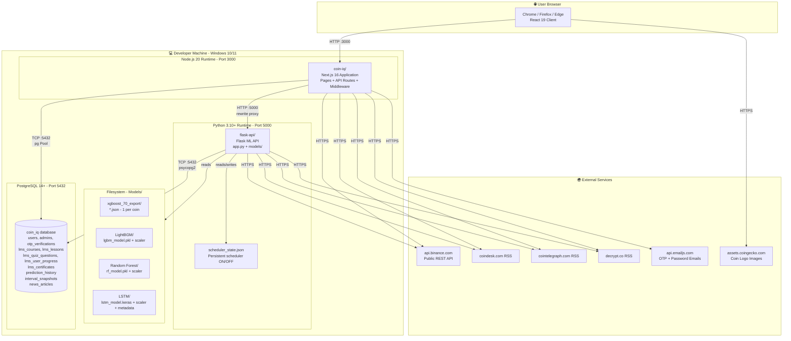
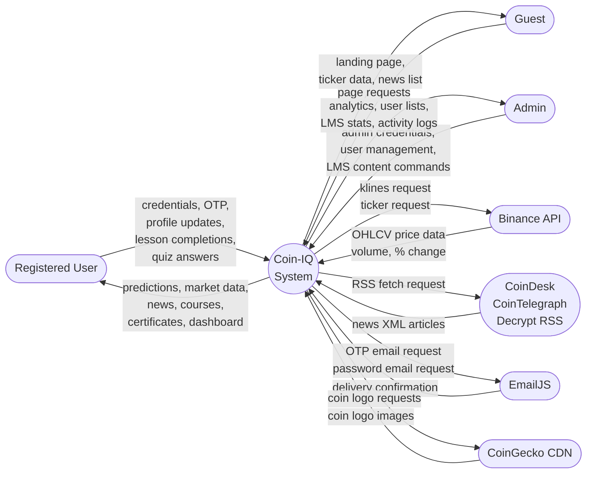
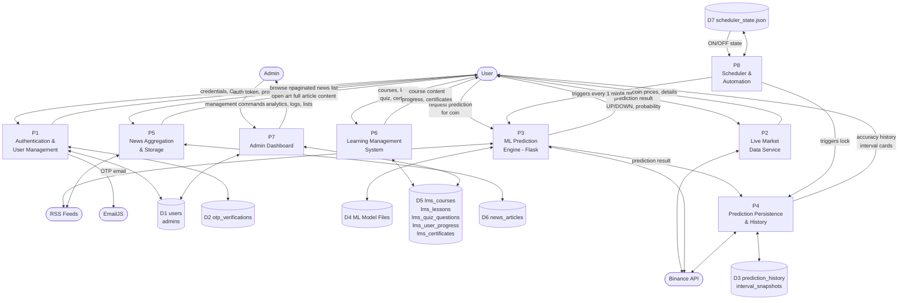

# Coin-IQ — Mermaid Diagrams

Go to https://mermaid.live → click "Code" tab → paste any block below → diagram renders instantly.

---

## 1. Use Case Diagram

```mermaid
graph TD
    subgraph Actors
        G([Guest])
        U([Registered User])
        A([Admin])
        F([Flask ML API])
        B([Binance API])
        R([RSS News Feeds])
    end

    subgraph Guest Use Cases
        UC1[View Landing Page]
        UC2[View Crypto Ticker]
        UC3[Browse News]
        UC4[Sign Up via OTP]
        UC5[Log In]
        UC6[Forgot Password]
    end

    subgraph Registered User Use Cases
        UC7[View Dashboard - Live Tab]
        UC8[View Dashboard - History Tab]
        UC9[Get Live Prediction for Coin]
        UC10[View Market vs Model Accuracy]
        UC11[Open Interval Detail Modal]
        UC12[Start / Stop Scheduler]
        UC13[Edit Profile]
        UC14[Browse Markets & Coins]
        UC15[View Analytics & Sentiment]
        UC16[Read Full News Article in Popup]
        UC17[Browse Learning Courses]
        UC18[Complete a Lesson]
        UC19[Take a Quiz]
        UC20[Earn a Certificate]
    end

    subgraph Admin Use Cases
        UC21[Access Admin Dashboard]
        UC22[View Platform Analytics]
        UC23[Manage Users CRUD]
        UC24[Manage LMS Courses]
        UC25[Revoke Certificates]
        UC26[Check Flask API Health]
    end

    subgraph System Use Cases
        UC27[Save Predictions Every Minute]
        UC28[Lock Interval Snapshots]
        UC29[Check Prediction Outcomes]
    end

    G --> UC1
    G --> UC2
    G --> UC3
    G --> UC4
    G --> UC5
    G --> UC6

    U --> UC7
    U --> UC8
    U --> UC9
    U --> UC10
    U --> UC11
    U --> UC12
    U --> UC13
    U --> UC14
    U --> UC15
    U --> UC16
    U --> UC17
    U --> UC18
    U --> UC19
    U --> UC20

    A --> UC21
    A --> UC22
    A --> UC23
    A --> UC24
    A --> UC25
    A --> UC26

    F --> UC27
    F --> UC28
    F --> UC29

    UC9 --> B
    UC27 --> B
    UC29 --> B
    UC3 --> R
    UC16 --> R

    UC19 -.->|extends| UC18
    UC20 -.->|extends| UC19
    UC4 -.->|includes| UC5
    UC8 -.->|includes| UC10
```

---

## 2. Class Diagram

```mermaid
classDiagram
    class User {
        +int id
        +string name
        +string email
        +string passwordHash
        +DateTime createdAt
        +DateTime updatedAt
    }

    class Admin {
        +int id
        +string name
        +string email
        +string passwordHash
        +string role
        +DateTime createdAt
    }

    class OtpVerification {
        +int id
        +string email
        +string otpCode
        +DateTime expiresAt
        +bool verified
        +int attempts
        +DateTime lockedUntil
    }

    class LmsCourse {
        +int id
        +string slug
        +string title
        +string description
        +string level
        +int lessonCount
        +int quizCount
        +string icon
    }

    class LmsLesson {
        +int id
        +int courseId
        +string title
        +string content
        +int order
    }

    class LmsQuizQuestion {
        +int id
        +int courseId
        +string question
        +string[] options
        +string correctAnswer
    }

    class LmsUserProgress {
        +int id
        +int userId
        +int courseId
        +int[] completedLessons
        +bool quizPassed
        +bool completed
    }

    class LmsCertificate {
        +int id
        +int userId
        +int courseId
        +string certificateId
        +DateTime issuedAt
    }

    class PredictionHistory {
        +int id
        +string coin
        +DateTime predictedAt
        +float priceAtPrediction
        +string ensembleDirection
        +float ensembleProbability
        +float outcomePrice
        +bool wasCorrect
    }

    class IntervalSnapshot {
        +int id
        +string sessionId
        +string coin
        +int intervalMinutes
        +DateTime predictedAt
        +float priceAtPrediction
        +string ensembleDirection
        +string actualDirection
        +float outcomePrice
        +bool wasCorrect
        +DateTime lockedAt
    }

    class NewsArticle {
        +int id
        +string title
        +string source
        +DateTime publishedAt
        +string description
        +string body
        +string url
        +string imageUrl
    }

    class XGBoostPredictor {
        +dict models
        +dict thresholds
        +predict(coin, features) PredictionResult
    }

    class LGBMPredictor {
        +model
        +scaler
        +list featureCols
        +predict(features) PredictionResult
    }

    class RandomForestPredictor {
        +model
        +scaler
        +list featureCols
        +predict(features) PredictionResult
    }

    class LSTMPredictor {
        +model
        +scaler
        +metadata
        +predict(sequence) PredictionResult
    }

    class BinanceFeatureBuilder {
        +fetchKlines(symbol) DataFrame
        +addIndicators(df) DataFrame
        +addSentiment(df, coin) DataFrame
        +buildFeaturesForCoin(symbol) FeatureSet
    }

    class NewsSentimentService {
        +getRssArticles() list
        +computeSentiment(articles) dict
        +getSentiment(coin) SentimentScore
    }

    class EnsembleOrchestrator {
        +runAllModels(coin) EnsembleResult
        +computeEnsemble(results) direction, probability
    }

    User "1" --> "many" LmsUserProgress
    User "1" --> "many" LmsCertificate
    LmsCourse "1" --> "many" LmsLesson
    LmsCourse "1" --> "many" LmsQuizQuestion
    LmsCourse "1" --> "many" LmsUserProgress
    LmsCourse "1" --> "many" LmsCertificate
    EnsembleOrchestrator --> XGBoostPredictor
    EnsembleOrchestrator --> LGBMPredictor
    EnsembleOrchestrator --> RandomForestPredictor
    EnsembleOrchestrator --> LSTMPredictor
    BinanceFeatureBuilder --> EnsembleOrchestrator
    NewsSentimentService --> BinanceFeatureBuilder
```

---

## 3. Activity Diagram

---

## 4. Sequence Diagram

---

## 5. Component Diagram

---

## 6. Deployment Diagram

---

## 7. DFD Level 0 — Context Diagram

---

## 8. DFD Level 1

